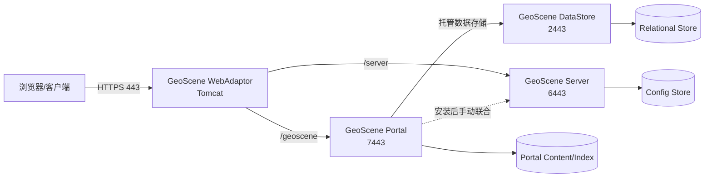
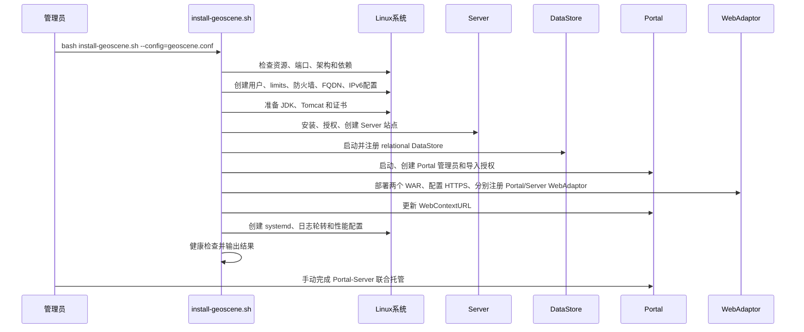

# GeoScene Enterprise 部署体系与脚本说明

本文档说明当前项目如何完成 GeoScene Enterprise 的安装、配置、运行维护和卸载。

当前脚本面向 GeoScene 6.1，整体流程也适用于安装结构相近的 4.1。项目将“可重复的基础部署”交给脚本，将 Portal-Server 联合托管等依赖业务判断的操作保留为安装后的手动步骤。

文档更新：**2026-08-18**。本版本已在 GeoScene 6.1 / Ubuntu 22.04 目标服务器完成安装验证，覆盖 Server、Portal、DataStore、Tomcat/WebAdaptor、IPv6 禁用、FQDN、证书、Creator 用户类型和健康检查；配置示例中的域名、邮箱和密码均为占位值。

## 1. 系统总体架构



### 组件和端口

| 组件 | 默认端口 | 作用 |
|---|---:|---|
| GeoScene Server | 6443 | 服务发布、Server Manager、REST 管理接口 |
| GeoScene Portal | 7443 | Portal 首页、Portal Admin、内容管理 |
| GeoScene DataStore | 2443 | 托管数据存储，供 Portal/Server 使用 |
| WebAdaptor/Tomcat | 443 | 对外统一 HTTPS 入口 |
| PublishingTools 等内部服务 | 9876/9877 | DataStore/发布相关内部通信 |

文档示例访问域名为：

```text
portal.example.com
```

如果使用 WebAdaptor，对外入口为：

```text
https://portal.example.com/geoscene
https://portal.example.com/server
```

其中 Portal 和 Server WebAdaptor 由当前安装脚本分别自动注册；Portal-Server 联合托管仍需要安装后手动完成。

## 2. 项目文件和服务器目录

### 2.1 部署包目录

```text
/geoscenedata/
├── install-geoscene.sh            # 主安装脚本
├── uninstall-geoscene.sh         # 卸载脚本
├── geoscene.conf                  # 部署配置
├── licfile/                       # 授权文件
├── GeoScene_Server_Linux_*.tar.gz
├── GeoScene_Portal_Linux_*.tar.gz
├── GeoScene_DataStore_Linux_*.tar.gz
└── GeoScene_Web_Adaptor_java_Linux_*.tar.gz
```

脚本按文件名识别组件和架构。生产部署时建议每类组件只保留一个目标版本的 Linux 安装包，并且只保留一份 Server 授权和一份 Portal 授权，避免自动匹配歧义。

授权文件名可以包含空格；脚本会在 Server 静默安装时复制为无空格的临时文件，并在安装结束后删除临时副本。

安装包也可以放在 `DATA_DIR`/`--data-dir` 指定的目录中；JDK/Tomcat 压缩包缺失时，`AUTO_DOWNLOAD=true` 会尝试联网下载。若使用自有 JDK/Tomcat，应配置 `JDK_HOME`、`TOMCAT_HOME` 并设置 `AUTO_DOWNLOAD=false`。

### 2.2 运行目录

```text
/home/geoscene/
└── geoscene/
    ├── server/
    ├── portal/
    ├── datastore/
    ├── webadaptor/
    └── collect-logs.sh

/opt/jdk/                         # 当前环境使用的 JDK
/opt/tomcat/                      # 当前环境使用的 Tomcat/WebAdaptor
/opt/tomcat/ssl/                  # WebAdaptor 证书
```

GeoScene 6.1 原厂安装器可能在组件目录下再生成 `geoscene/<component>`，例如 `$GS_BASE/server/geoscene/server`。安装、systemd、备份、日志和卸载脚本会自动解析实际组件 home，不要求手工移动目录。

### 2.3 系统级文件

| 文件 | 作用 |
|---|---|
| `/etc/hostname` | 主机名 |
| `/etc/hosts` | FQDN、主机名和本机 IP 映射 |
| `/etc/sysctl.d/99-geoscene-ipv6.conf` | IPv6 禁用配置 |
| `/etc/security/limits.d/99-geoscene.conf` | GeoScene 用户资源限制 |
| `/etc/systemd/system/geosceneserver.service` | Server 服务 |
| `/etc/systemd/system/geosceneportal.service` | Portal 服务 |
| `/etc/systemd/system/geoscenedatastore.service` | DataStore 服务 |
| `/etc/systemd/system/geoscene-tomcat.service` | WebAdaptor Tomcat 服务 |
| `/etc/logrotate.d/geoscene` | GeoScene 日志轮转 |

## 3. 脚本职责

### `install-geoscene.sh`

主安装脚本，实际入口为 `main_with_enhancements`，主要负责：

1. 创建安装前备份。
2. 检查 root 权限、内存、磁盘、端口、命令依赖和安装包架构。
3. 创建 `geoscene` 用户、组、home 及安装目录。
4. 配置 limits、systemd 全局限制和防火墙。
5. 设置主机名、FQDN 和 `/etc/hosts`。
6. 根据配置禁用 IPv6。
7. 安装或复用 JDK、Tomcat。
8. 创建或复用 WebAdaptor HTTPS 证书。
9. 静默安装 Server、DataStore、Portal、WebAdaptor。
10. 复制授权并完成 Server 授权、站点创建、DataStore 注册和 Portal 创建。
11. 部署两个 WebAdaptor WAR context、配置 Tomcat HTTPS，并分别注册 Portal/Server WebAdaptor。
12. 更新 Portal WebContextURL。
13. 创建 systemd 服务、性能参数和日志管理。
14. 执行安装后健康检查并输出访问地址。

### `geoscene.conf`

部署参数文件。命令行参数优先级最高，其次是配置文件，最后是脚本默认值：

```text
命令行参数 > geoscene.conf > install-geoscene.sh 默认值
```

### `uninstall-geoscene.sh`

负责按顺序停止服务、调用官方卸载程序、删除 systemd、防火墙和系统配置。默认卸载保留数据、JDK/Tomcat、用户 home、备份和日志；只有 `--purge` 才清理安装目录、JDK/Tomcat 和用户 home，备份与日志分别由 `--remove-backups`、`--remove-logs` 控制。

### 生成的 `collect-logs.sh`

位于 `/home/geoscene/geoscene/collect-logs.sh`，用于收集：

- `/var/log/geoscene*.log`
- Server、Portal、DataStore 日志

最终生成 `/tmp/geoscene-logs-<时间戳>.tar.gz`。

## 4. 配置文件说明

以下是配置结构示例，密码使用占位符，实际部署必须替换：

```ini
DATA_DIR=/geoscenedata
LICENSE_DIR=/geoscenedata/licfile

SERVER_LICENSE_FILE=GeoSceneServerAdvanced_GeoSceneServer_1626763.ecp
PORTAL_LICENSE_FILE=GeoScene_Enterprise_Portal_61_576425_20260720.json

FQDN=portal.example.com
HOSTNAME=portal
CONFIGURE_HOSTNAME=true
CONFIGURE_HOSTS=true
DISABLE_IPV6=true

SERVER_PORT=6443
PORTAL_PORT=7443
DATASTORE_PORT=2443

SITE_ADMIN_USER=siteadmin
SITE_ADMIN_PASS=<请替换>
PORTAL_ADMIN_USER=portaladmin
PORTAL_ADMIN_PASS=<请替换>
PORTAL_ADMIN_USER_TYPE=creatorUT
PORTAL_ADMIN_EMAIL=admin@example.com
PORTAL_ADMIN_FN=Admin
PORTAL_ADMIN_LN=User
PORTAL_ADMIN_QI=1
PORTAL_ADMIN_QA=<请替换>

INSTALL_WEBADAPTOR=true
WEBADAPTOR_PORT=443
WEBADAPTOR_CONTEXT=geoscene
TOMCAT_HOME=/opt/tomcat
JDK_HOME=/opt/jdk
JDK_VERSION=17

CREATE_SELF_SIGNED_CERT=true
CERT_COUNTRY=CN
CERT_STATE=Beijing
CERT_CITY=Beijing
CERT_ORG=portal.example.com
CERT_OU=portal.example.com
CERT_EMAIL=admin@example.com
CERT_DAYS=3650
CERT_PASSWORD=<请替换>

AUTO_DOWNLOAD=true
```

`AUTO_DOWNLOAD=true` 时，缺少 JDK/Tomcat 本地压缩包会尝试联网下载；如果已经准备好并验证过 `JDK_HOME`、`TOMCAT_HOME`，可设置为 `false`。

### 重要配置项

| 配置 | 说明 |
|---|---|
| `DATA_DIR` | 安装包所在目录 |
| `LICENSE_DIR` | 授权文件目录 |
| `FQDN` | 所有对外注册和 WebAdaptor 参数使用的完全限定域名 |
| `HOSTNAME` | 主机短名称 |
| `DISABLE_IPV6` | 是否禁用 IPv6，默认建议为 `true` |
| `PORTAL_ADMIN_USER_TYPE` | Portal 管理员用户类型；GeoScene 6.1 实机验证使用 `creatorUT` |
| `TOMCAT_HOME` | 已有 Tomcat 的安装路径 |
| `JDK_HOME` | 已有 JDK 的安装路径 |
| `AUTO_DOWNLOAD` | 缺少 JDK/Tomcat 时是否联网下载 |
| `CREATE_SELF_SIGNED_CERT` | 是否生成自签名证书 |
| `CERT_PASSWORD` | PKCS12/PFX 证书密码 |

### 密码和证书要求

- 管理员密码至少 8 位，并包含大小写字母和数字。
- 不要将真实密码提交到 Git 或写入共享文档。
- 配置文件建议使用 `root:root` 和 `600` 权限。
- 自签名证书适合测试环境；生产环境建议替换为企业 CA 证书。

## 5. 自动安装流程



### 实际执行顺序

```text
前置检查
  → 系统用户/权限/防火墙
  → IPv6、hostname、hosts、FQDN
  → JDK/Tomcat
  → 证书
  → Server 安装、授权、建站
  → DataStore 启动和注册
  → Portal 创建和授权
  → systemd 服务
  → WebAdaptor HTTPS 和 Portal 注册
  → Portal WebContextURL
  → 性能、日志、健康检查
```

## 6. 安装命令

### 首次安装

必须使用 Bash，不要使用 `sh`：

```bash
cd /geoscenedata
bash ./install-geoscene.sh --config=/geoscenedata/geoscene.conf
```

直接使用脚本同目录配置时也可以：

```bash
bash ./install-geoscene.sh
```

### 预演检查

```bash
bash ./install-geoscene.sh --config=/geoscenedata/geoscene.conf --dry-run
```

### 指定自有 JDK/Tomcat

配置文件方式：

```ini
JDK_HOME=/opt/jdk
TOMCAT_HOME=/opt/tomcat
AUTO_DOWNLOAD=false
```

命令行覆盖方式：

```bash
bash ./install-geoscene.sh \
  --config=/geoscenedata/geoscene.conf \
  --jdk-home=/opt/jdk \
  --tomcat-home=/opt/tomcat
```

目录必须分别包含：

```text
JDK_HOME/bin/java
TOMCAT_HOME/bin/catalina.sh
```

### 重复执行

脚本支持幂等执行，会尽量复用现有安装、站点、证书和 DataStore 配置。重复执行前仍建议查看日志和服务状态。

当 Server、Portal、DataStore、WebAdaptor 均已安装时，重复运行会切换为配置模式，跳过软件解压安装，并继续补做或更新站点、DataStore、WebAdaptor、systemd 和健康检查。

需要切换安装包或清理后重装时，可以使用 `--reinstall`；`--data-dir`、`--jdk-home` 和 `--tomcat-home` 可用于命令行覆盖对应路径。

## 7. WebAdaptor 和联合托管

### 7.1 脚本自动完成的部分

当前安装脚本会：

- 部署 `geoscene.war`（Portal context）和 `server.war`（Server context）。
- 创建 `/geoscene` 根路径重定向。
- 配置 Tomcat 443 HTTPS Connector。
- 使用 FQDN 分别注册 Portal 和 Server WebAdaptor。
- 使用已有有效 `server.xml` 备份恢复损坏配置。
- 清理实际启用的 8080/8009 Connector，避免误删 XML 注释中的示例 Connector。

Portal WebAdaptor 注册参数逻辑等价于：

```bash
./configurewebadaptor.sh \
  -m portal \
  -w https://portal.example.com/geoscene/webadaptor \
  -g https://portal.example.com:7443 \
  -u <PORTAL_ADMIN_USER> \
  -p '<PORTAL_ADMIN_PASS>'
```

### 7.2 Server WebAdaptor 注册参数

当前脚本会自动执行 Server WebAdaptor 注册。注册参数等价于：

```bash
cd <GeoScene WebAdaptor安装包目录>/tools
source /etc/environment

./configurewebadaptor.sh \
  -m server \
  -w https://portal.example.com/server/webadaptor \
  -g https://portal.example.com:6443 \
  -u <SITE_ADMIN_USER> \
  -p '<SITE_ADMIN_PASS>' \
  -a true
```

返回以下内容表示注册成功：

```text
Successfully Registered.
```

如果需要单独重试 Server 注册，可在 WebAdaptor 工具目录手动执行上面的命令；这不会执行 Portal-Server 联合托管。

### 7.3 Portal-Server 联合托管

联合托管已从自动脚本中移除，原因是联合过程需要确认 Server URL、Admin URL、WebContextURL、证书信任和托管服务策略。

安装完成后，进入 Portal 管理界面完成：

```text
组织/门户管理 → 设置 → Servers/服务器 → 添加服务器
```

建议使用以下域名地址，不要混用 IP：

```text
Server 服务 URL: https://portal.example.com/server
Server Admin URL: https://portal.example.com/server/admin
```

如果未配置 Server WebAdaptor，则使用 Server 的 6443 地址，并确保 Portal 能够解析和访问该域名。

## 8. systemd 服务管理

安装脚本实际创建的服务名称是：

```bash
geosceneserver.service
geosceneportal.service
geoscenedatastore.service
geoscene-tomcat.service
```

查看状态：

```bash
systemctl status geosceneserver geosceneportal geoscenedatastore geoscene-tomcat
```

重启服务：

```bash
systemctl restart geosceneserver
systemctl restart geosceneportal
systemctl restart geoscenedatastore
systemctl restart geoscene-tomcat
```

查看端口：

```bash
ss -ltnp | grep -E ':(443|6443|7443|2443)\b'
```

Tomcat 服务使用 `CAP_NET_BIND_SERVICE` 以 `geoscene` 用户绑定 443，不需要用 root 运行 Tomcat。

## 9. 安装验证

### 9.1 主机名和 IPv6

```bash
hostname -f
getent ahosts localhost
sysctl net.ipv6.conf.all.disable_ipv6
sysctl net.ipv6.conf.default.disable_ipv6
sysctl net.ipv6.conf.lo.disable_ipv6
```

当 `DISABLE_IPV6=true` 时，`localhost` 应优先/仅解析为 `127.0.0.1`，上述三个 sysctl 值应为 `1`。

### 9.2 服务 API

```bash
curl -k https://portal.example.com:6443/geoscene/rest/info?f=pjson
curl -k https://portal.example.com:7443/geoscene/sharing/rest/info?f=json
curl -kL https://portal.example.com:2443/geoscene/datastore?f=json
curl -k https://portal.example.com/geoscene/sharing/rest/info?f=json
curl -k https://portal.example.com/server/rest/info?f=pjson
```

Server 的 `/rest` 服务目录可能被管理员禁用，直接访问不带 `f=pjson` 的地址时出现 403 不代表 Server 不可用；应使用上面的 JSON API 地址验证。DataStore 入口会重定向，因此验证时使用 `-L`。

自签名证书环境使用 `-k` 仅用于测试验证；生产环境应导入受信任 CA 证书。

### 9.3 日志

```text
/var/log/geoscene_YYYYMMDD_HHMMSS.log
/var/log/.geoscene_install_state
/opt/tomcat/logs/
/home/geoscene/geoscene/server/usr/logs/
/home/geoscene/geoscene/portal/usr/logs/
/home/geoscene/geoscene/datastore/usr/logs/
```

收集日志：

```bash
bash /home/geoscene/geoscene/collect-logs.sh
```

## 10. 卸载和清理

### 安全卸载

停止服务、调用官方卸载程序并清理服务配置，但保留数据和部分运行目录：

```bash
cd /geoscenedata
bash ./uninstall-geoscene.sh
```

### 彻底清理

删除 GeoScene 安装目录、`geoscene` 用户 home、JDK、Tomcat 和相关服务：

```bash
bash ./uninstall-geoscene.sh --purge
```

同时清理备份和日志：

```bash
bash ./uninstall-geoscene.sh --purge --remove-backups --remove-logs
```

通常 `/geoscenedata` 下的安装包、授权、配置和脚本不会被 `--purge` 删除，便于后续重新安装。执行前应确认没有需要保留的用户数据。

卸载参数：

| 参数 | 作用 |
|---|---|
| `--silent` | 调用 GeoScene 官方静默卸载器 |
| `--purge` | 删除安装目录、JDK/Tomcat、用户 home 等运行数据 |
| `--remove-backups` | 删除安装前备份 |
| `--remove-logs` | 删除安装日志、健康报告和卸载日志 |
| `--force` | 忽略单项错误并继续清理 |
| `--config=FILE`、`--gs-user`、`--gs-base` | 指定配置、运行用户和安装目录 |

## 11. 常见问题

### `set: Illegal option -o pipefail`

原因是使用了 `sh`：

```bash
sh install-geoscene.sh
```

正确方式：

```bash
bash install-geoscene.sh
```

### Portal 提示 localhost 无法解析到 127.0.0.1

检查：

```bash
getent ahosts localhost
```

确认配置中存在：

```ini
FQDN=portal.example.com
CONFIGURE_HOSTS=true
DISABLE_IPV6=true
```

然后重新执行安装脚本的配置流程。

### WebAdaptor 提示 443 未监听

按顺序检查：

```bash
systemctl status geoscene-tomcat
ss -ltnp | grep ':443'
tail -100 /opt/tomcat/logs/catalina.*.log
grep -n 'Connector port' /opt/tomcat/conf/server.xml
```

重点检查 `server.xml` 是否为有效 XML、证书路径是否存在、443 是否被其他进程占用，以及 JDK/Tomcat 路径是否正确。

### DataStore 重复配置长时间不返回

当前脚本会检测：

```text
/home/geoscene/geoscene/datastore/usr/datastore/etc/relational-config.json
```

如果该文件已经存在，脚本会跳过重复的 relational 配置，避免重复调用官方配置工具。

### FQDN 能解析但浏览器仍提示证书错误

如果使用自签名证书，这是预期现象。测试环境可以导入 `/opt/tomcat/ssl/webcert.crt`；生产环境应替换为包含目标 FQDN 的企业 CA 证书。

## 12. 生产部署检查清单

- [ ] 使用 Linux、正确架构的四类安装包。
- [ ] Server 和 Portal 授权文件各只保留一份。
- [ ] 已配置真实 FQDN，并确认 DNS 或 `/etc/hosts` 可解析。
- [ ] 已修改 Server、Portal、证书和安全问答密码。
- [ ] `geoscene.conf` 权限为 `600`。
- [ ] `JDK_HOME` 和 `TOMCAT_HOME` 指向经过验证的版本。
- [ ] 生产环境使用企业 CA 证书，而不是长期自签名证书。
- [ ] 443、6443、7443、2443、9876、9877 端口策略已确认。
- [ ] 安装后确认 Portal WebAdaptor 和 Server WebAdaptor 均已注册。
- [ ] 安装后手动完成 Portal-Server 联合托管。
- [ ] 已保存安装日志、健康检查结果和备份目录。
- [ ] 已验证重启后 Server、Portal、DataStore 和（启用 WebAdaptor 时）Tomcat systemd 服务能够恢复。

## 13. 当前脚本边界

当前版本明确不自动完成以下动作：

1. Portal-Server 联合托管。
2. 依赖业务策略的 Server 托管服务配置。
3. 生产 CA 证书申请和签发。
4. 外部 DNS、负载均衡器和反向代理配置。

这些操作需要根据项目的域名、证书、访问策略和业务组织结构手动确认。

## 14. 操作系统和机器选择

### 14.1 脚本层面的兼容条件

脚本不是按某个发行版名称硬编码的，主要依赖以下 Linux 能力：

- Bash、systemd、`systemctl`。
- `curl`、`tar`、`hostname`、`ip`、`awk`、`ss`、`openssl` 等命令。
- `apt-get`、`yum`、`dnf`、`zypper` 或 `pacman` 之一，用于补充依赖。
- GeoScene 6.1 安装器要求 `en_US.UTF-8`；脚本会检查并尝试通过系统包管理器生成，失败时终止安装。
- 可写的 `/etc`、systemd、sysctl、防火墙配置。
- 与服务器 CPU 架构一致的 GeoScene Linux 安装包。

脚本会检查 `uname -m`，并根据安装包文件名判断 `x86_64`、`amd64`、`arm64` 或 `aarch64`。因此，CPU 架构比“Ubuntu 还是麒麟”更容易造成硬性失败：ARM 机器不能直接使用 x86_64 安装包。

如果服务器使用海光 C86，通常应按 x86-64 兼容服务器准备安装包；不要只根据“国产 CPU”把它误判成 ARM。安装前仍以实际输出为准：

```bash
uname -m
lscpu | grep -E 'Architecture|架构|Vendor ID|Model name'
```

当 `uname -m` 返回 `x86_64` 时，Server、Portal、DataStore、WebAdaptor、JDK 和 Tomcat 都应选择 x86_64/amd64 版本。

### 14.2 常见操作系统建议

| 操作系统 | 脚本适配判断 | 建议 |
|---|---|---|
| 银河麒麟 V10 | 通常可运行；需要确认 systemd、Bash、包管理器和 CPU 架构 | 国产化项目优先选用已验证的 x86_64 或 ARM 版本，并确认 GeoScene 6.1 对应支持矩阵 |
| Ubuntu | 通常可运行；脚本可识别 `apt-get` | 建议使用项目已验证的 LTS 版本，不要直接把最新版本当作已认证版本 |
| RHEL 兼容发行版 | 通常可运行；脚本可识别 `yum/dnf` | 新项目优先考虑仍在维护的 RHEL、Rocky Linux 或同类发行版 |
| CentOS Linux 8 | 脚本可能可以运行，但不适合作为新生产系统 | CentOS Linux 8 已于 2021-12-31 结束生命周期，不建议新部署 |
| CentOS Stream | 需要按 Stream 主版本和 GeoScene 6.1 支持矩阵验证 | 不建议未经验证直接用于生产 |

GeoScene 公开产品页面列出了包括银河麒麟、统信、Red Hat、SUSE、Ubuntu、Oracle、Rocky 等在内的主流操作系统，但这不等于每个 GeoScene 版本、补丁级别和 CPU 组合都自动获得认证；最终应以 GeoScene 6.1 的正式支持矩阵和对应安装包为准。

### 14.3 硬件建议

脚本配置的最低检查值是：

```text
CPU：4 核
内存：8192 MB
安装盘可用空间：30 GB
用户 home 可用空间：20 GB
```

这只是“能够开始安装”的门槛，不是生产容量规划。Server、Portal、DataStore 和 WebAdaptor 全部安装在同一台机器时，建议根据服务数量、并发用户、索引大小、缓存和数据量提高 CPU、内存和磁盘配置；生产环境还应优先使用 SSD、独立数据盘和定期备份。

### 14.4 上线前必须验证

在目标机器上先执行：

```bash
cat /etc/os-release
uname -m
command -v bash systemctl curl tar hostname ip awk ss openssl
free -h
df -h /home /geoscenedata
```

然后确认：

1. GeoScene 安装包架构与 `uname -m` 一致。
2. JDK/Tomcat 的架构与系统一致。
3. 6443、7443、2443、443、9876、9877 没有被无关进程占用。
4. FQDN 能解析到业务 IP，且服务器自身也能解析该 FQDN。
5. 麒麟的安全策略、SELinux/AppArmor、挂载参数没有阻止 `geoscene` 用户执行 Java、写入安装目录或绑定服务端口。
